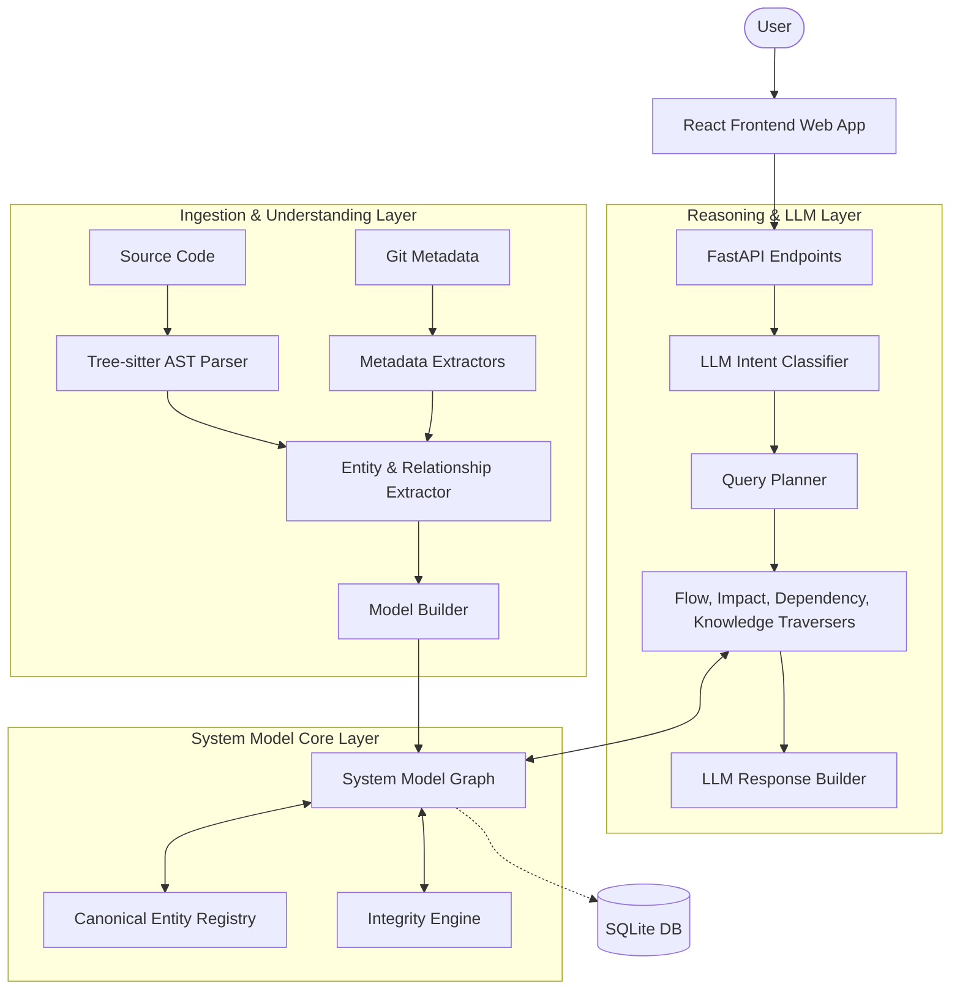

# CodeLens: Engineering Knowledge Operating System (EKOS)

CodeLens is an advanced **Engineering Knowledge Operating System (EKOS)** designed to transform fragmented software project knowledge into a unified, queryable, and machine-understandable Software System Model. 

Current engineering knowledge is often scattered across source code repositories, Confluence pages, architecture documents, RFCs, and Git histories. CodeLens bridges this gap by automatically ingesting these heterogeneous sources and building a deterministic, persistent, and hierarchical knowledge graph, augmented with **Large Language Models (LLMs)** for natural language querying and synthesis.

The ultimate goal: **The Software System Model is the product.** Everything else in CodeLens exists to build, maintain, query, and present that model.

---

## 🌟 Key Features

* **Deterministic-First Extraction**: Prioritizes AST (Abstract Syntax Tree) parsing and Git metadata over probabilistic LLM extraction for absolute accuracy on code structures.
* **Hierarchical Ontology**: Unlike flat code search tools, CodeLens understands the hierarchy from Business Domains down to individual Code Functions (`Domain → Capability → Feature → Workflow → Service → Module → Class → Function`).
* **Intelligent Query Routing (LLM Powered)**: Uses Llama 3 to classify natural language queries and route them to specific graph traversal algorithms (e.g., Dependency tracking, Call Chain tracing, or Project Summarization).
* **Conversational Synthesis**: Translates raw JSON graph traversal results into beautiful, human-readable markdown summaries using AI.
* **Premium Glassmorphism UI**: A stunning, hardware-accelerated React frontend that renders dynamic Mermaid.js architecture diagrams and live graph health metrics.
* **Declarative Graph Integrity**: Built-in rules engine to ensure model health (e.g., "Every API endpoint must belong to a service", "No dangling edges").
* **Local-First Database**: Uses SQLite as the single persistence layer for ACID compliance and portability, requiring no mandatory cloud services.

---

## 🏗️ System Architecture (HLD)

CodeLens is built as a modular pipeline with distinct layers interacting with the central SQLite graph database.



---

## 🚀 Getting Started

### Prerequisites
* Python 3.12+
* Node.js v20+ (for the frontend)
* Git
* (Optional) NVIDIA API Key for LLM Inference

### 1. Backend Setup

We strongly recommend running CodeLens within a Python virtual environment.

```bash
git clone https://github.com/your-org/codelens-ekos.git
cd codelens-ekos

# Create and activate a virtual environment
python -m venv venv

# On Windows:
.\venv\Scripts\activate
# On macOS/Linux:
# source venv/bin/activate

# Install dependencies
pip install -r backend/requirements.txt
```

Set up your environment variables for the LLM API:
```bash
# Create a .env file in the root
echo "NVIDIA_API_KEY=your_nvidia_api_key_here" > .env
```

Run the backend server:
```bash
uvicorn backend.main:app --host 127.0.0.1 --port 8000
```

### 2. Frontend Setup

Open a new terminal window, ensuring you have Node.js installed.

```bash
cd frontend

# Install dependencies
npm install

# Start the Vite development server
npm run dev
```

The frontend will be available at **`http://localhost:5173`**.

---

## 💡 Usage Workflow

1. **Monitor Health**: Open the frontend Dashboard (`http://localhost:5173`) to see the current integrity score, nodes, and edges of your Graph Database.
2. **Explore the Project**: Use the search bar to ask general questions:
   * *"Tell me about the project"* (Generates a full architectural summary of services and domains)
3. **Deep Architecture Queries**: Ask specific flow or dependency questions:
   * *"How does Booking work?"* (Generates a dynamic sequence/flow diagram)
   * *"What depends on the User model?"* (Generates an impact/dependency graph)
   
The LLM will automatically parse your intent, query the SQLite graph, and synthesize a markdown response paired with a Mermaid.js diagram and citations!

---

## 🛠️ Technology Stack

* **Frontend**: React, Vite, Vanilla CSS (Glassmorphism), Lucide React, Mermaid.js
* **Backend**: FastAPI (Python)
* **LLM Integration**: OpenAI SDK (compatible with NVIDIA NIMs / Llama 3.3 70B)
* **Persistence**: SQLite (with WAL mode & FTS5 Full-Text Search)
* **Code Parsing**: Tree-sitter
* **Graph Algorithms**: NetworkX

---

## 🎯 Vision

The ultimate vision for CodeLens is to serve as the foundational **brain** for AI coding assistants and engineering teams, shifting the paradigm from simple *text-based RAG* to deep, *model-driven reasoning* about software systems.
